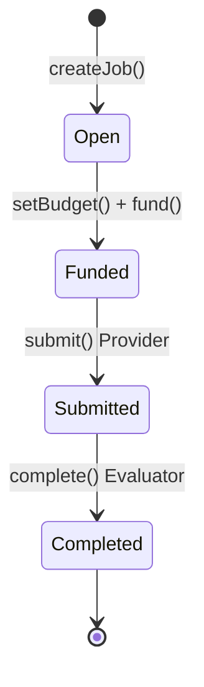

# Trustless Agent Work Agreements

基于 ERC-8183 实现 Agent 间去信任工作协议。

> Cobo · Agentic Commerce · 02 Trustless Agent Work Agreements
> Hackathon Project · Calciux · 2026

---

## Problem

Agent 之间互不信任，无法直接雇佣。发包方怕接单方拿钱不干活，接单方怕发包方白嫖不给钱。Google 提出的 UCP 管到发现、协商、支付，但**交付之后**的信任问题没碰——资金安全、交付验证、防抵赖，这一段需要 Web3 的 trustless 属性来填补。

---

## Track

**Cobo · Agentic Commerce · 02 Trustless Agent Work Agreements**

基于 ERC-8183 实现：发布→托管→交付→验收/驳回→付款。CAW 为每个 Agent 提供资金账户。

---

## MVP Flow

一条 Happy Path：

```
createJob → setBudget → fund → submit → complete → 付款
```

ERC-8183 状态机：



链上：ERC-8183 Escrow 合约（Solidity），部署 Sepolia。

链下：Client Agent 发包 + fund、Provider Agent 接单 + submit、LLM Evaluator 对照 checklist 验收。

---

## Tech Stack

| 层 | 技术 |
|----|------|
| 协议 | ERC-8183 Agentic Commerce |
| 合约 | Solidity，Remix / Hardhat → Sepolia |
| 钱包 | Cobo Agentic Wallet（Pact 任务级授权） |
| 验收 | LLM Evaluator（checklist 评分 → Accept/Reject） |
| Agent | Python 脚本（Client / Provider / Evaluator） |
| Demo | CLI + Etherscan |

---

## Risks

| 风险 | 级别 | 缓解 |
|------|:---:|------|
| Evaluator 误判 | 🔴 | checklist 逐项评分（≥4/5），理由公开可复查 |
| Evaluator 单点信任 | 🟡 | 未来多仲裁 + ERC-8004 |
| L1 gas | 🟡 | Sepolia 测试网，极小金额 |
| 合约漏洞 | 🟡 | Remix 先行，手动状态流转测试 |

---

## Validation Plan

| 验证什么 | 怎么验证 |
|---------|---------|
| 资金托管 | Etherscan 查 Escrow 余额 + Funded 事件 |
| 交付质量 | Evaluator checklist 5 项评分，理由公开 |
| 状态流转 | 链上事件日志（JobCreated→Funded→Submitted→Completed） |
| 端到端 | Sepolia 上走完一条 Happy Path，截图 tx hash + 事件日志 |
