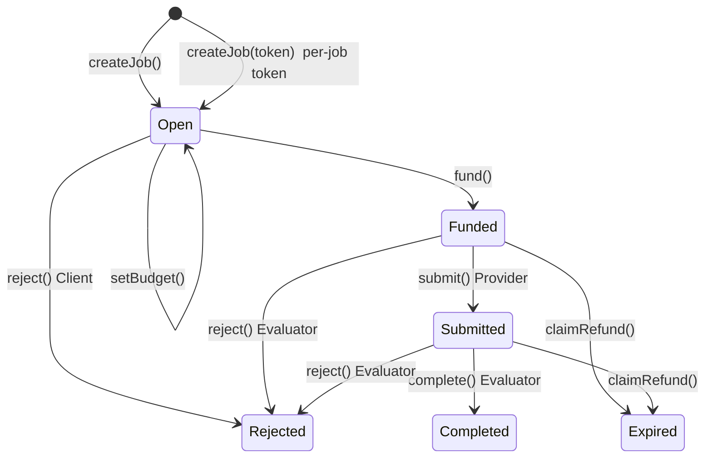

# Trustless Agent Work Agreements

> Cobo · Agentic Commerce · 02 Trustless Agent Work Agreements
> Hackathon Project · 2026

基于 ERC-8183 实现 Agent 间去信任工作协议：Client Agent 发布任务并托管资金 → Provider Agent 交付结果 → LLM Evaluator 自动验收 → 通过则付款，不通过则退款。

---

## Problem

Agent 之间互不信任，无法直接雇佣。

- 发包方怕接单方拿钱不干活
- 接单方怕发包方白嫖不给钱
- 验收标准模糊，出问题没法追溯


---

## Why AI

- **7×24 独立验收**：LLM Evaluator 根据任务类型自适应生成验收 checklist，不需要人盯
- **边界内自主**：Agent 在预设的金额上限、函数白名单、交易频率限制内自主执行，人在事前设边界、事后管争议
- **自然语言交互**：用户用自然语言描述需求（"帮我 swap 0.1 ETH 换 USDT，报酬 100 TTK"），Agent 理解意图、生成 Pact 策略、执行链上操作

没有 AI：退化为需要人来判断每一笔验收的多签钱包。

---

## Why Web3

- **资金托管 trustless**：钱锁在 ERC-8183 Escrow 合约里，Client fund 后无法单方面撤资，只有独立 Evaluator 能决定放款给 Provider 或退款给 Client
- **链上收据不可篡改**：每一步操作（createJob → setBudget → fund → submit → complete）都有 tx hash + 事件日志，Etherscan 可查

---

## How It Works

### Architecture

```
┌──────────────────────────────────────────────────────────┐
│                    Streamlit Frontend                    │
│                   自然语言输入 → 实时进度                  │
└──────────┬──────────────────┬──────────────────┬─────────┘
           │                  │                  │
    ┌──────▼──────┐   ┌──────▼──────┐   ┌──────▼──────┐
    │ Client Agent│   │Provider Agent│   │Evaluator    │
    │ 发包+托管    │   │ 接单+提交    │   │ LLM验收裁决  │
    └──────┬──────┘   └──────┬──────┘   └──────┬──────┘
           │                  │                  │
    ┌──────▼──────────────────▼──────────────────▼──────┐
    │              Cobo CAW (Agentic Wallet)             │
    │      Pact 策略 → 审批 → 执行 → 3 钱包隔离           │
    └──────────────────────┬────────────────────────────┘
                           │
    ┌──────────────────────▼────────────────────────────┐
    │            ERC-8183 Escrow (Sepolia)               │
    │         createJob → fund → submit → complete       │
    │                + SimpleSwapHook                    │
    └───────────────────────────────────────────────────┘
```

### ERC-8183 State Machine



### PACT_OPTIMIZED Mode

| 模式 | Pact 审批 | Contract Call 审批 | 总计 |
|------|:--:|:--:|:--:|
| 原始模式 | 6 次 | 6 次 | 12 次 |
| **优化模式** | **3 次** | **0 次** | **3 次** |

优化模式通过角色级合并 Pact + `always_review=false` + 函数白名单 + 金额边界实现。CAW App 批准一次策略后，边界内的多步交易全部自动执行。

### Tech Stack

| 层 | 技术 |
|----|------|
| 协议 | ERC-8183 Agentic Commerce |
| 合约 | Solidity 0.8.25, Foundry |
| 测试 | 147 用例 (119 unit + 28 integration) |
| 网络 | Sepolia (Chain ID 11155111) |
| 钱包 | Cobo CAW (Agentic Wallet) — 3 个角色隔离 |
| 验收 | LLM Evaluator (DeepSeek) |
| 前端 | Streamlit (Python) |
| Hook | SimpleSwapHook (submit 时自动拉取代币) |

---

## Demo

### On-Chain Evidence (Sepolia)

三份可验证的链上测试：

| # | Job | 特点 | 状态 | 关键 Tx |
|---|:--:|------|:--:|------|
| Job #4 | Swap with Hook | SimpleSwapHook: ETH mock 真实流转 | Completed | [complete tx](https://sepolia.etherscan.io/tx/0xd01ffaaab4964bad89a1bf08d0f3bdb116fb2b1b971ed56b6ffce0dc9289647c) |
| Job #17 | Manual Pact | 原始模式：12 次用户确认 | Completed | [complete tx](https://sepolia.etherscan.io/tx/0x8ae9944f3a86eca5a4bb961859173abc0894684de9f0c2ce4a7f095415bd7e75) |
| Job #19 | Auto Pact | 优化模式：3 次 Pact 审批 | Completed | [complete tx](https://sepolia.etherscan.io/tx/0xd6be420a417dd08b3eb200eae3860552b5c6ccdee730239e350cb7fbd9843c2d) |

### Deployed Contracts

| 合约 | Sepolia 地址 |
|------|-------------|
| ERC-8183 Escrow | `0x5C46deBd8A308e69e56955A8eE647Bf75694dc59` |
| SimpleSwapHook | `0x3e60B331BC98133B81174D906d7E86a07C7aecA4` |
| TTK Token (mock) | `0xCcb19a9e5a4e7eb8eD779c45FF7A6641a4f06cb3` |
| ETH (mock) | `0x94022198f8497F98a47d24B754a602AD2A97FE99` |
| USDT (mock) | `0x8c7D953c2c897E471Bf5A7BE8532AF79258e0BEb` |

### CAW Wallets

| 角色 | 地址 |
|------|------|
| Client | `0x736859c94664Dd29A1bdae8FA075e928b60541Bc` |
| Provider | `0xe2b749ce285b86ff058653336191dec2be50f32c` |
| Evaluator | `0xf6459a8868dc4d6db511f535f27887e54d2f0d6d` |

### Demo Video

*(待录制)*

1. 打开 Streamlit 面板，输入 "帮我 swap 0.1 ETH 换 USDT，报酬 100 TTK"
2. LLM 解析意图，生成合并 Pact → CAW App 审批（3 次）
3. Client Agent 链上执行 approve → createJob → setBudget → fund
4. Provider Agent 链上执行 submit（自动拉取产出代币 via Hook）
5. Evaluator LLM 自动裁决 → complete → 放款
6. 打开 Etherscan 验证 6 笔 tx + 事件日志 + 余额变化

---

## Validation

所有验证项均可通过 Etherscan 或命令行复现：

| 验证什么 | 怎么验证 |
|---------|---------|
| 资金托管 | Etherscan 查 Escrow 余额 + Funded/Refunded/PaymentReleased 事件 |
| 交付质量 | Evaluator checklist 5 项评分，理由公开可复查 |
| 状态流转 | 链上事件日志（JobCreated→Funded→Submitted→Completed） |
| Hook 行为 | SimpleSwapHook swap 参数 + transferFrom/transfer 记录 |
| 端到端 | Sepolia 真链走完 3 条独立任务（详见 [docs/reports/](docs/reports/)） |

```bash
# 命令行验证示例
cast call 0x5C46deBd8A308e69e56955A8eE647Bf75694dc59 \
  "getStatus(uint256)(uint8)" 19 \
  --rpc-url https://ethereum-sepolia-rpc.publicnode.com
# 返回: 3 (= Completed)
```

---

## Risks

| 风险 | 级别 | 缓解 |
|------|:--:|------|
| Evaluator 误判 | 🔴 | checklist 逐项评分（≥4/5 通过），理由公开可复查 |
| Evaluator 单点信任 | 🟡 | MVP 一个 Evaluator；未来 ERC-8004 多仲裁 + 声誉集成 |
| L1 gas 太高 | 🟡 | Sepolia 测试网，极小金额 |
| 合约漏洞 | 🟡 | 147 测试覆盖，Foundry 静态分析，Etherscan 已验证 |
| Hook 依赖 CAW 审批 | 🟡 | Hook 产生的额外 token transfer 在 Pact 范围内自动放行 |

---

## Team

**Calciux** — AI/ML 背景学习 Web3 开发。独立完成合约设计、测试、部署、前端、Cobo CAW 集成全栈。

---

## Quick Start

### 环境要求

| 工具 | 版本 | 用途 |
|------|------|------|
| Python | ≥3.10 | Streamlit 前端 |
| Foundry (forge) | latest nightly | 合约编译/测试/部署 |
| Git | — | 克隆仓库 |

### 1. 克隆仓库

```bash
git clone https://github.com/Calciux/Trustless-Agent-Work-Agreements.git
cd Trustless-Agent-Work-Agreements
```

### 2. 安装 Foundry 依赖

```bash
forge install
```

### 3. 编译合约

```bash
forge build
```

### 4. 运行测试（可选，验证环境）

```bash
forge test
# 预期: 147/147 全部通过
```

### 5. 部署合约到 Sepolia（可选）

合约已在 Sepolia 上部署，可直接使用。如需重新部署：

```bash
# 复制环境变量模板
cp .env.example .env

# 编辑 .env，填入：
#   CLIENT_ADDRESS=你的地址
#   CLIENT_PRIVATE_KEY=你的私钥
#   SEPOLIA_RPC_URL=https://ethereum-sepolia-rpc.publicnode.com
#   ETHERSCAN_API_KEY=你的Etherscan API Key（可选，用于合约验证）

# 一键部署（代币 + Escrow + Hook）
forge script script/Deploy.s.sol:Deploy \
  --rpc-url $SEPOLIA_RPC_URL \
  --broadcast \
  --verify \
  -vvvv
```

### 6. 安装 Python 依赖

```bash
cd streamlit_app
pip install -r requirements.txt
```

### 7. 配置环境变量

Streamlit 需要以下环境变量。创建 `streamlit_app/.env`：

```bash
# LLM API Key（必填——Evaluator 验收依赖）
DEEPSEEK_API_KEY=sk-your-deepseek-api-key

# 以下已有 Sepolia 预设值，无需修改
TTK_ADDR=0xCcb19a9e5a4e7eb8eD779c45FF7A6641a4f06cb3
ESCROW_ADDR=0x5C46deBd8A308e69e56955A8eE647Bf75694dc59
SWAP_HOOK_ADDR=0x3e60B331BC98133B81174D906d7E86a07C7aecA4
ETH_ADDR=0x94022198f8497F98a47d24B754a602AD2A97FE99
USDT_ADDR=0x8c7D953c2c897E471Bf5A7BE8532AF79258e0BEb
SEPOLIA_RPC_URL=https://ethereum-sepolia-rpc.publicnode.com
```

### 8. 启动前端

**手动模式**（每步在 CAW App 审批）：

```bash
streamlit run app.py --server.port 8501
```

**PACT_OPTIMIZED 模式**（3 次审批完成全流程）：

```bash
bash start_optimized.sh
# 或手动设置环境变量:
# export SKIP_CAW=false PACT_OPTIMIZED=true
# streamlit run app.py --server.port 8501
```

启动后浏览器打开 `http://localhost:8501`。

### 9. 走一次 Demo

在 Streamlit 输入框输入：

```
帮我 swap 0.1 ETH 换 USDT，报酬 100 TTK
```

前端将依次执行：
1. LLM 解析意图 → 生成合并 Pact
2. CAW App 审批（3 次 Pact）
3. Client: approve → createJob → setBudget → fund
4. Provider: submit
5. Evaluator: LLM 裁决 → complete
6. 查看 Etherscan 验证链上证据

---

## License

MIT
