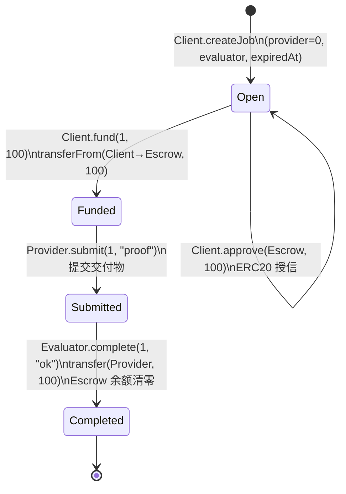

# IT-001 链上流转解析 — 无手续费 Happy Path 有限自动机

> 测试函数：`test_IT001_HappyPath_NoFee` | 状态：✅ PASS | Gas：4,127,008

---

## 1. 角色钱包地址

| 角色 | 钱包地址 |
|------|----------|
| **Client**（客户端/付款方） | `0xD5e069BC58dedb2a3A348995ee753Eef0274004F` |
| **Provider**（服务提供方） | `0x9B78803558F9Ea56F4f0a966322C8dD9B2fBebc0` |
| **Evaluator**（验收方） | `0xCA5453e74F0CCC802aDd48A547cd965512fFd45d` |
| **Treasury**（手续费收款方） | `0x0000000000000000000000000000000000000000`（零地址=无手续费） |
| MockERC20 代币合约 | `0x5615dEB798BB3E4dFa0139dFa1b3D433Cc23b72f` |
| ERC8183Escrow 托管合约 | `0x2e234DAe75C793f67A35089C9d99245E1C58470b` |

---

## 2. 有限自动机状态图

```
                    ┌───────────────────────────────────────────┐
                    │               ERC-8183 状态机              │
                    │         IT-001: feeBps=0, budget=100       │
                    └───────────────────────────────────────────┘

        Client                   Client                Evaluator
    createJob(...)           fund(1, 100)          complete(1,"ok")
  ┌───────┐               ┌───────┐               ┌───────────┐
  │       │               │       │               │           │
  │ Open  │──────────────▶│Funded │──────────────▶│Submitted │──────────▶│Completed│
  │       │               │       │               │           │           │         │
  └───────┘               └───────┘               └───────────┘           └─────────┘
      │                       ▲                         ▲                      │
      │                       │                         │                      │
      └── setProvider(1,P) ───┘          submit(1,"proof")          PaymentReleased
         setBudget(1,100)                 (Provider)                Provider +100
         approve(Escrow,100)                                        Escrow → 0
         (均为 Client)                                              (无 Treasury 转账)
```

### Mermaid 格式（可复制到 Obsidian）



---

## 3. 逐步流转详解

### 前置：合约部署 & 初始铸币

```
[部署者] → new MockERC20("Test Token", "TTK", 18)
          地址: 0x5615dEB798BB3E4dFa0139dFa1b3D433Cc23b72f

[部署者] → new ERC8183Escrow(token=MockERC20, treasury=0x0, feeBps=0)
          地址: 0x2e234DAe75C793f67A35089C9d99245E1C58470b
          → 这两个参数决定了：complete 时不抽取任何手续费

[部署者] → MockERC20.mint(Client, 100)
          → Client 余额: 0 → 100
```

**此时各账户余额**：

| 账户 | 余额 |
|------|------|
| Client (`0xD5e...004F`) | 100 |
| Provider (`0x9B7...ebc0`) | 0 |
| Escrow (`0x2e2...470b`) | 0 |
| Treasury (`0x0`) | 0 |

---

### Step 1: createJob — 进入 Open 状态

```
msg.sender: Client (0xD5e069BC58dedb2a3A348995ee753Eef0274004F)

ERC8183Escrow.createJob(
    provider  = 0x0000000000000000000000000000000000000000,  ← 暂不指定
    evaluator = 0xCA5453e74F0CCC802aDd48A547cd965512fFd45d,
    expiredAt = 604801,
    description = "desc",
    hook      = 0x0000000000000000000000000000000000000000
)
```

**发生了什么**：
1. 合约分配 `jobId = 1`，`jobCount` 从 0 → 1
2. 在链上创建一个 Job 结构体，写入 storage：
   - `job[1].client` = `0xD5e...004F`
   - `job[1].evaluator` = `0xCA5...d45d`
   - `job[1].provider` = `0x0`（待后续 setProvider 指定）
   - `job[1].budget` = `0`（待后续 setBudget 指定）
   - `job[1].status` = `0`（= `Status.Open`）
   - `job[1].description` = `"desc"`
   - `job[1].expiredAt` = `604801`
3. 发出事件 `JobCreated(1, Client, 0x0, Evaluator, 604801)`

**状态**：`Open` — Job 已创建，等待 Provider 分配和预算设定。

---

### Step 2: setProvider — 指定 Provider

```
msg.sender: Client (0xD5e069BC58dedb2a3A348995ee753Eef0274004F)

ERC8183Escrow.setProvider(1, 0x9B78803558F9Ea56F4f0a966322C8dD9B2fBebc0)
```

**发生了什么**：
- Storage 写入：`job[1].provider` 从 `0x0` → `0x9B7...ebc0`
- 发出事件 `ProviderSet(1, 0x9B7...ebc0)`

**状态**：仍然是 `Open`。Provider 已被记录，但预算尚未设定，资金尚未托管。

> 设计说明：Provider 地址在 Open 状态下可修改。一旦 fund 进入 Funded 状态后不可再改。

---

### Step 3: setBudget — 设定预算

```
msg.sender: Client (0xD5e069BC58dedb2a3A348995ee753Eef0274004F)

ERC8183Escrow.setBudget(1, 100)
```

**发生了什么**：
- Storage 写入：`job[1].budget` 从 `0` → `100`
- 发出事件 `BudgetSet(1, 100)`

**状态**：仍然是 `Open`。预算值记录在链上，但尚未实际划转。

> 设计说明：budget 是 fund 时的校验参数（expectedBudget），防止 Client 批准额度与实际托管金额不一致。

---

### Step 4: approve — ERC20 授信

```
msg.sender: Client (0xD5e069BC58dedb2a3A348995ee753Eef0274004F)

MockERC20.approve(
    spender = 0x2e234DAe75C793f67A35089C9d99245E1C58470b,  ← Escrow 合约
    amount  = 100
)
```

**发生了什么**：
- ERC20 Storage 写入：`allowance[Client][Escrow]` 从 `0` → `100`
- 返回 `true`

**状态**：仍然是 `Open`。这一步在链上是独立的 ERC20 操作，不属于 ERC8183Escrow 合约的 storage。

> 为什么 approve 要单独做：ERC20 的 `approve` + `transferFrom` 是两段式授权模式。`fund()` 内部调用 `transferFrom`，如果未预先 approve 会 revert。

---

### Step 5: fund — 资金托管，进入 Funded 状态 🔴 关键状态转换

```
msg.sender: Client (0xD5e069BC58dedb2a3A348995ee753Eef0274004F)

ERC8183Escrow.fund(1, expectedBudget=100)
  └─ 内部调用 MockERC20.transferFrom(Client, Escrow, 100)
```

**发生了什么**：
1. 合约校验 `job[1].budget == expectedBudget`（100 == 100 ✓）
2. 合约校验 `job[1].provider != address(0)`（已 setProvider ✓）
3. 合约校验 `job[1].status == Status.Open`（当前是 Open ✓）
4. 调用 `MockERC20.transferFrom(Client → Escrow, 100)`：
   - `Client` 余额：100 → 0
   - `Escrow` 余额：0 → 100
   - `allowance[Client][Escrow]`：100 → 0（消耗完毕）
5. `job[1].status`：0（Open）→ 1（Funded）
6. 发出事件 `JobFunded(1, Client, 100)`

**此时各账户余额**：

| 账户 | 余额 | 变化 |
|------|------|------|
| Client (`0xD5e...004F`) | 0 | -100 |
| Escrow (`0x2e2...470b`) | 100 | +100 |
| Provider (`0x9B7...ebc0`) | 0 | — |
| Treasury (`0x0`) | 0 | — |

**状态**：`Funded` — 资金已锁定在托管合约中，Client 无法单方面撤回（只能等 expiredAt 到期后 claimRefund）。Job 状态从 Open 进入 Funded，此后 provider、budget 不可再修改。

---

### Step 6: submit — Provider 提交交付物，进入 Submitted 状态 🔴 关键状态转换

```
msg.sender: Provider (0x9B78803558F9Ea56F4f0a966322C8dD9B2fBebc0)

ERC8183Escrow.submit(
    jobId       = 1,
    deliverable = 0x70726f6f66000000000000000000000000000000000000000000000000000000
                  ↑ bytes32("proof")
)
```

**发生了什么**：
1. 合约校验 `msg.sender == job[1].provider`（Provider 地址匹配 ✓）
2. 合约校验 `job[1].status == Status.Funded`（当前是 Funded ✓）
3. `job[1].status`：1（Funded）→ 2（Submitted）
4. 发出事件 `JobSubmitted(1, Provider, 0x70726f6f66...)`

**状态**：`Submitted` — Provider 已提交交付物证明（链上只存 bytes32 hash，实际内容在链下）。等待 Evaluator 验收。

---

### Step 7: complete — Evaluator 验收通过，资金释放 🔴 关键状态转换

```
msg.sender: Evaluator (0xCA5453e74F0CCC802aDd48A547cd965512fFd45d)

ERC8183Escrow.complete(
    jobId  = 1,
    reason = 0x6f6b000000000000000000000000000000000000000000000000000000000000
             ↑ bytes32("ok")
)
  └─ 内部调用 MockERC20.transfer(Provider, 100)
```

**发生了什么**：
1. 合约校验 `msg.sender == job[1].evaluator`（Evaluator 地址匹配 ✓）
2. 合约校验 `job[1].status == Status.Submitted`（当前是 Submitted ✓）
3. 手续费计算：`fee = budget * feeBps / 10000 = 100 * 0 / 10000 = 0`
4. Provider 应收：`providerAmount = budget - fee = 100 - 0 = 100`
5. 调用 `MockERC20.transfer(Provider, 100)`：
   - `Escrow` 余额：100 → 0
   - `Provider` 余额：0 → 100
6. 由于 feeBps=0 且 treasury=address(0)，不向 treasury 转账
7. `job[1].status`：2（Submitted）→ 3（Completed）
8. 发出两个事件：
   - `JobCompleted(1, Evaluator, bytes32("ok"))`
   - `PaymentReleased(1, Provider, 100)`

**状态**：`Completed` — 终态。资金已从托管合约转出，Job 生命周期结束。

---

## 4. 最终余额

| 账户 | 地址 | 最终余额 | 变化 |
|------|------|---------|------|
| Client | `0xD5e069BC58dedb2a3A348995ee753Eef0274004F` | 0 | -100 |
| Escrow | `0x2e234DAe75C793f67A35089C9d99245E1C58470b` | 0 | 0（+100 后 -100） |
| Provider | `0x9B78803558F9Ea56F4f0a966322C8dD9B2fBebc0` | 100 | +100 |
| Treasury | `0x0000000000000000000000000000000000000000` | 0 | 0 |

---

## 5. 状态转换汇总表

| # | 步骤 | msg.sender | 函数 | 状态变化 | Gas |
|---|------|-----------|------|----------|-----|
| 0 | — | Deployer | `new ERC8183Escrow(token, 0x0, 0)` | 部署 | 3,729,685 |
| 1 | createJob | Client | `createJob(0x0, Evaluator, 604801, "desc", 0x0)` | — → Open | 123,451 |
| 2 | setProvider | Client | `setProvider(1, Provider)` | Open（storage 更新） | 46,458 |
| 3 | setBudget | Client | `setBudget(1, 100)` | Open（storage 更新） | 43,987 |
| 4 | approve | Client | `token.approve(Escrow, 100)` | ERC20 操作 | 23,085 |
| 5 | fund | Client | `fund(1, 100)` | **Open → Funded** | 69,288 |
| 6 | submit | Provider | `submit(1, "proof")` | **Funded → Submitted** | 24,731 |
| 7 | complete | Evaluator | `complete(1, "ok")` | **Submitted → Completed** | 49,965 |

---

## 6. 有限自动机形式化定义

```
M = (Q, Σ, δ, q₀, F)

Q  = {Open, Funded, Submitted, Completed, Cancelled, Refunded}  ← 全量状态
     （本次测试只用到前 4 个）

Σ  = {createJob, setProvider, setBudget, approve_in_erc20, fund, submit, complete}

q₀ = ⊥（合约部署后无 Job 存在，createJob 即创建初始状态）

F  = {Completed}

δ 转移函数（本次测试的实际路径）：
  ⊥                          → Open        (createJob)
  Open                       → Open        (setProvider, setBudget, approve)
  Open                       → Funded      (fund)
  Funded                     → Submitted   (submit)
  Submitted                  → Completed   (complete)
```
