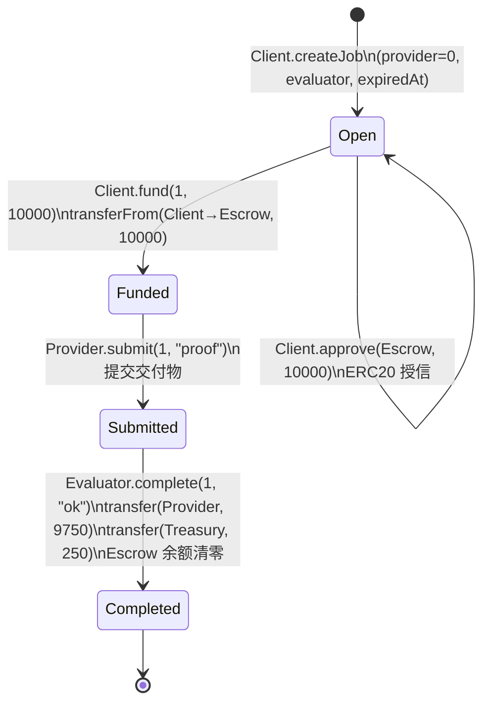

# IT-002 链上流转解析 — 有手续费 Happy Path 有限自动机

> 测试函数：`test_IT002_HappyPath_WithFee` | 状态：✅ PASS | Gas：4,193,179

---

## 1. 角色钱包地址

| 角色 | 钱包地址 |
|------|----------|
| **Client**（客户端/付款方） | `0xD5e069BC58dedb2a3A348995ee753Eef0274004F` |
| **Provider**（服务提供方） | `0x9B78803558F9Ea56F4f0a966322C8dD9B2fBebc0` |
| **Evaluator**（验收方） | `0xCA5453e74F0CCC802aDd48A547cd965512fFd45d` |
| **Treasury**（手续费收款方） | `0xf43Bca55E8091977223Fa5b776E23528D205dcA8` |
| MockERC20 代币合约 | `0x5615dEB798BB3E4dFa0139dFa1b3D433Cc23b72f` |
| ERC8183Escrow 托管合约 | `0x2e234DAe75C793f67A35089C9d99245E1C58470b` |

> 与 IT-001 的关键差异：Treasury 有真实地址（`0xf43...cA8`），`feeBps=250`。

---

## 2. 有限自动机状态图

```
                    ┌───────────────────────────────────────────┐
                    │               ERC-8183 状态机              │
                    │    IT-002: feeBps=250, budget=10000        │
                    └───────────────────────────────────────────┘

        Client                   Client                Evaluator
    createJob(...)           fund(1, 10000)        complete(1,"ok")
  ┌───────┐               ┌───────┐               ┌───────────┐
  │       │               │       │               │           │
  │ Open  │──────────────▶│Funded │──────────────▶│Submitted │──────────▶│Completed│
  │       │               │       │               │           │           │         │
  └───────┘               └───────┘               └───────────┘           └─────────┘
      │                       ▲                         ▲                      │
      │                       │                         │                      │
      └── setProvider(1,P) ───┘          submit(1,"proof")          PaymentReleased
         setBudget(1,10000)                (Provider)               Provider +9750
         approve(Escrow,10000)                                       Treasury +250
         (均为 Client)                                              Escrow → 0
                                                                    (两笔 transfer)
```

### Mermaid 格式（可复制到 Obsidian）



---

## 3. 手续费模型

```
feeBps = 250  →  费率 = 250/10000 = 2.5%

complete 时的计算：
  fee            = budget × feeBps / 10000
                 = 10000  × 250    / 10000
                 = 250

  providerAmount = budget - fee
                 = 10000  - 250
                 = 9750
```

---

## 4. 逐步流转详解

### 前置：合约部署 & 初始铸币

```
[部署者] → new MockERC20("Test Token", "TTK", 18)
          地址: 0x5615dEB798BB3E4dFa0139dFa1b3D433Cc23b72f

[部署者] → new ERC8183Escrow(
              token    = MockERC20,
              treasury = 0xf43Bca55E8091977223Fa5b776E23528D205dcA8,  ← 真实 treasury 地址
              feeBps   = 250                                           ← 2.5% 手续费
           )
          地址: 0x2e234DAe75C793f67A35089C9d99245E1C58470b
          Storage:
            slot 0 (treasury) → 0xf43...cA8
            slot 1 (feeBps)   → 250

[部署者] → MockERC20.mint(Client, 10000)
          → Client 余额: 0 → 10000
```

**此时各账户余额**：

| 账户 | 地址 | 余额 |
|------|------|------|
| Client | `0xD5e069BC58dedb2a3A348995ee753Eef0274004F` | 10000 |
| Provider | `0x9B78803558F9Ea56F4f0a966322C8dD9B2fBebc0` | 0 |
| Escrow | `0x2e234DAe75C793f67A35089C9d99245E1C58470b` | 0 |
| Treasury | `0xf43Bca55E8091977223Fa5b776E23528D205dcA8` | 0 |

---

### Step 1: createJob — 进入 Open 状态

```
msg.sender: Client (0xD5e069BC58dedb2a3A348995ee753Eef0274004F)

ERC8183Escrow.createJob(
    provider  = 0x0000000000000000000000000000000000000000,
    evaluator = 0xCA5453e74F0CCC802aDd48A547cd965512fFd45d,
    expiredAt = 604801,
    description = "desc",
    hook      = 0x0000000000000000000000000000000000000000
)
```

**发生了什么**：
- 合约分配 `jobId = 1`，`jobCount`：0 → 1
- Storage 写入：
  - `job[1].description` = `"desc"`
  - `job[1].expiredAt` = `604801`
  - `job[1].client` = `0xD5e...004F`
  - `job[1].evaluator` = `0xCA5...d45d`
  - `job[1].provider` = `0x0`（待 setProvider）
  - `job[1].budget` = `0`（待 setBudget）
  - `job[1].status` = `0`（Open）
- 事件：`JobCreated(1, Client, 0x0, Evaluator, 604801)`

**状态**：`Open`。

---

### Step 2: setProvider — 指定 Provider

```
msg.sender: Client (0xD5e069BC58dedb2a3A348995ee753Eef0274004F)

ERC8183Escrow.setProvider(1, 0x9B78803558F9Ea56F4f0a966322C8dD9B2fBebc0)
```

**发生了什么**：
- Storage：`job[1].provider` 从 `0x0` → `0x9B7...ebc0`
- 事件：`ProviderSet(1, 0x9B7...ebc0)`

**状态**：仍然是 `Open`。

---

### Step 3: setBudget — 设定预算

```
msg.sender: Client (0xD5e069BC58dedb2a3A348995ee753Eef0274004F)

ERC8183Escrow.setBudget(1, 10000)
```

**发生了什么**：
- Storage：`job[1].budget` 从 `0` → `10000`
- 事件：`BudgetSet(1, 10000)`

**状态**：仍然是 `Open`。

---

### Step 4: approve — ERC20 授信

```
msg.sender: Client (0xD5e069BC58dedb2a3A348995ee753Eef0274004F)

MockERC20.approve(
    spender = 0x2e234DAe75C793f67A35089C9d99245E1C58470b,
    amount  = 10000
)
```

**发生了什么**：
- ERC20 Storage：`allowance[Client][Escrow]` 从 `0` → `10000`
- 返回 `true`

**状态**：仍然是 `Open`。

---

### Step 5: fund — 资金托管，进入 Funded 状态 🔴

```
msg.sender: Client (0xD5e069BC58dedb2a3A348995ee753Eef0274004F)

ERC8183Escrow.fund(1, expectedBudget=10000)
  └─ MockERC20.transferFrom(Client, Escrow, 10000)
```

**发生了什么**：
1. 校验 `budget == expectedBudget`（10000 == 10000 ✓）
2. 校验 `provider != address(0)` ✓
3. 校验 `status == Open` ✓
4. `transferFrom(Client → Escrow, 10000)`：
   - `Client` 余额：10000 → 0
   - `Escrow` 余额：0 → 10000
   - `allowance[Client][Escrow]`：10000 → 0
5. `job[1].status`：0（Open）→ 1（Funded）
6. 事件：`JobFunded(1, Client, 10000)`

**此时各账户余额**：

| 账户 | 地址 | 余额 | 变化 |
|------|------|------|------|
| Client | `0xD5e...004F` | 0 | -10000 |
| Escrow | `0x2e2...470b` | 10000 | +10000 |
| Provider | `0x9B7...ebc0` | 0 | — |
| Treasury | `0xf43...cA8` | 0 | — |

**状态**：`Funded`。10000 token 锁定在托管合约中。

---

### Step 6: submit — Provider 提交交付物，进入 Submitted 状态 🔴

```
msg.sender: Provider (0x9B78803558F9Ea56F4f0a966322C8dD9B2fBebc0)

ERC8183Escrow.submit(
    jobId       = 1,
    deliverable = 0x70726f6f66000000000000000000000000000000000000000000000000000000
                  ↑ bytes32("proof")
)
```

**发生了什么**：
1. 校验 `msg.sender == provider` ✓
2. 校验 `status == Funded` ✓
3. `job[1].status`：1（Funded）→ 2（Submitted）
4. 事件：`JobSubmitted(1, Provider, 0x70726f6f66...)`

**状态**：`Submitted`。

---

### Step 7: complete — Evaluator 验收通过，资金分账释放 🔴🔴

```
msg.sender: Evaluator (0xCA5453e74F0CCC802aDd48A547cd965512fFd45d)

ERC8183Escrow.complete(
    jobId  = 1,
    reason = 0x6f6b000000000000000000000000000000000000000000000000000000000000
             ↑ bytes32("ok")
)
  ├─ MockERC20.transfer(Provider, 9750)    ← 分账第1笔：Provider 收款
  └─ MockERC20.transfer(Treasury, 250)     ← 分账第2笔：Treasury 收手续费
```

**发生了什么**（这是 IT-002 与 IT-001 最关键的区别）：

1. 校验 `msg.sender == evaluator` ✓
2. 校验 `status == Submitted` ✓
3. **手续费计算**：`fee = 10000 * 250 / 10000 = 250`
4. **Provider 应收**：`providerAmount = 10000 - 250 = 9750`

5. **第一笔转账** `MockERC20.transfer(Provider, 9750)`：
   - `Escrow` 余额：10000 → 250
   - `Provider` 余额：0 → 9750

6. **第二笔转账** `MockERC20.transfer(Treasury, 250)`：
   - `Escrow` 余额：250 → 0
   - `Treasury` 余额：0 → 250

7. `job[1].status`：2（Submitted）→ 3（Completed）
8. 事件：
   - `JobCompleted(1, Evaluator, "ok")`
   - `PaymentReleased(1, Provider, 9750)` ← 注意：金额是 9750 而非 budget

**状态**：`Completed` — 终态。资金完全从托管合约释放。

---

## 5. 最终余额

| 账户 | 地址 | 最终余额 | 变化 |
|------|------|---------|------|
| Client | `0xD5e069BC58dedb2a3A348995ee753Eef0274004F` | 0 | -10000 |
| Escrow | `0x2e234DAe75C793f67A35089C9d99245E1C58470b` | 0 | 0 |
| Provider | `0x9B78803558F9Ea56F4f0a966322C8dD9B2fBebc0` | 9750 | +9750 |
| Treasury | `0xf43Bca55E8091977223Fa5b776E23528D205dcA8` | 250 | +250 |

**验证**：
```
Escrow 入账:      10000
Escrow 出账:      9750 + 250 = 10000
净差:             0 ✓

手续费占比:        250 / 10000 = 2.5% = feeBps / 10000 ✓
```

---

## 6. 状态转换汇总表

| # | 步骤 | msg.sender | 函数 | 状态变化 | Gas |
|---|------|-----------|------|----------|-----|
| 0 | — | Deployer | `new ERC8183Escrow(token, 0xf43...cA8, 250)` | 部署（含手续费配置） | 3,769,485 |
| 1 | createJob | Client | `createJob(0x0, Evaluator, 604801, "desc", 0x0)` | — → Open | 123,451 |
| 2 | setProvider | Client | `setProvider(1, Provider)` | Open（storage 更新） | 46,458 |
| 3 | setBudget | Client | `setBudget(1, 10000)` | Open（storage 更新） | 43,987 |
| 4 | approve | Client | `token.approve(Escrow, 10000)` | ERC20 操作 | 23,085 |
| 5 | fund | Client | `fund(1, 10000)` | **Open → Funded** | 69,288 |
| 6 | submit | Provider | `submit(1, "proof")` | **Funded → Submitted** | 24,731 |
| 7 | complete | Evaluator | `complete(1, "ok")` | **Submitted → Completed** | 73,739 |

---

## 7. IT-001 vs IT-002 差异对比

| 维度 | IT-001（无手续费） | IT-002（有手续费） |
|------|-------------------|---------------------|
| Constructor treasury | `address(0)` | `0xf43Bca55E8091977223Fa5b776E23528D205dcA8` |
| Constructor feeBps | `0` | `250` |
| budget | `100` | `10000` |
| complete 转账次数 | 1 次（→ Provider） | 2 次（→ Provider + → Treasury） |
| complete 总 Gas | 49,965 | 73,739 |
| Provider 最终余额 | `100` | `9750` |
| Treasury 最终余额 | `0` | `250` |
| PaymentReleased 金额 | `100`（= budget） | `9750`（= budget - fee） |
| 状态机路径 | 完全一致 | 完全一致 |

---

## 8. 有限自动机形式化定义

```
M = (Q, Σ, δ, q₀, F)

Q  = {Open, Funded, Submitted, Completed, Cancelled, Refunded}

Σ  = {createJob, setProvider, setBudget, approve_in_erc20, fund, submit, complete}

q₀ = ⊥

F  = {Completed}

δ（本次测试的实际路径）：
  ⊥                          → Open        (createJob)
  Open                       → Open        (setProvider, setBudget, approve)
  Open                       → Funded      (fund)
  Funded                     → Submitted   (submit)
  Submitted                  → Completed   (complete)

手续费在 complete 转移中体现，不改变状态机结构。
```
